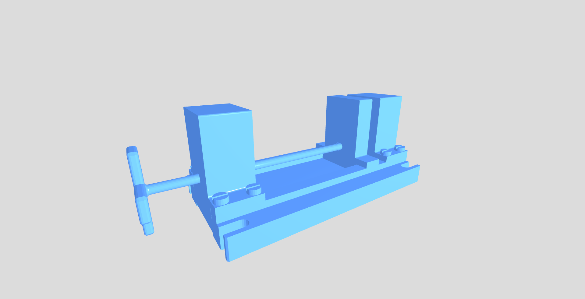
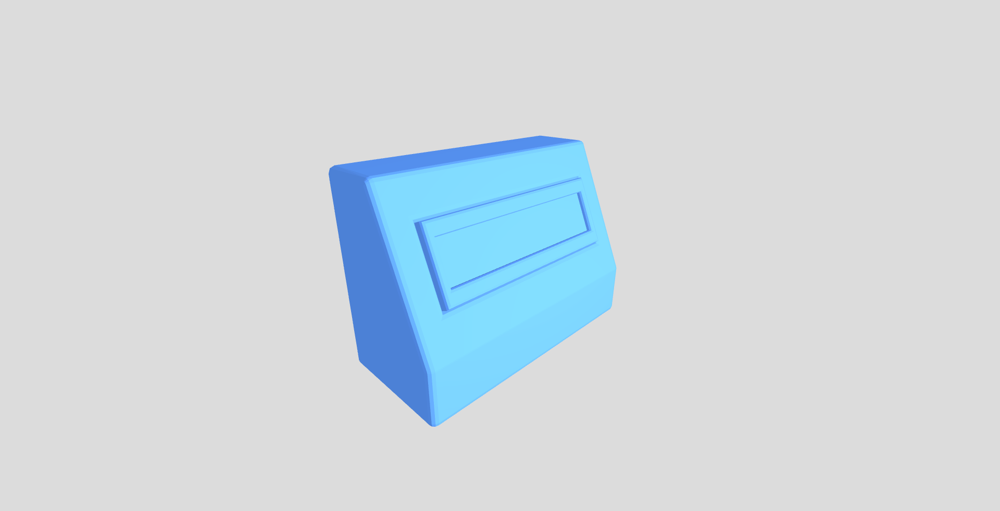

# Средство просмотра 3D на Electron JS

## Демонстрация





## Установка

```
git clone https://github.com/golubtsov/3d-view-desktop.git

cd 3d-view-desktop

npm i

npm run tailwind
```

### Запуск приложения

```
npm start
```

### Сборка установочного пакета

```
npm run package-mac
```

```
npm run package-linux
```

```
npm run package-win
```

### Горячие клавиши
``S`` - сохранить рабочую область в PNG
