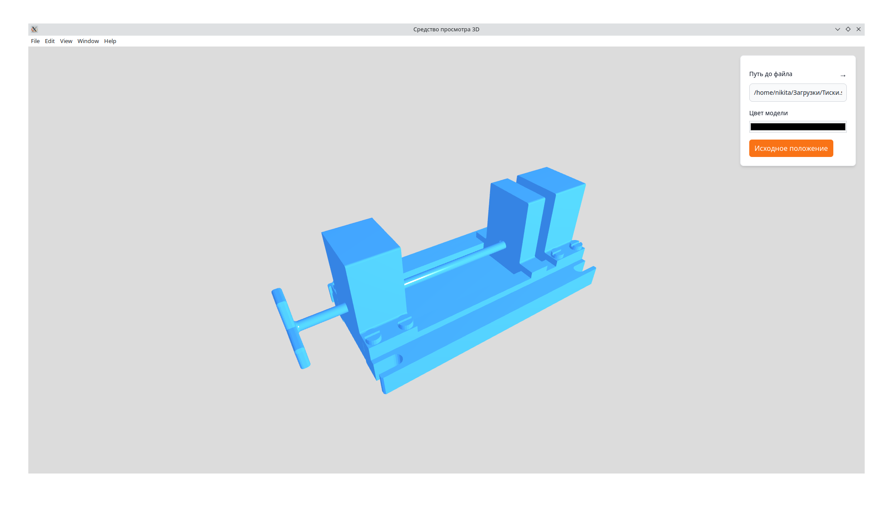
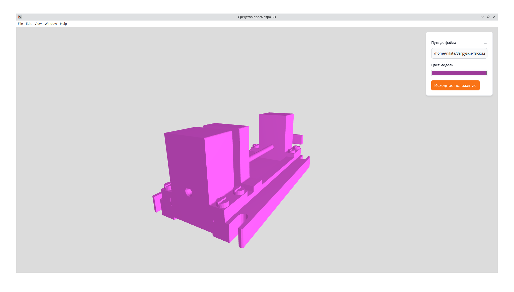

# Средство просмотра 3D на Electron JS

## Демонстрация





## Установка

```
git clone https://github.com/golubtsov/3d-view-desktop.git

cd 3d-view-desktop

npm i
```

### Запуск приложения

```
npm start
```

### Сборка установочного пакета

```php
npm run package-mac
npm run package-linux
npm run package-win
```
